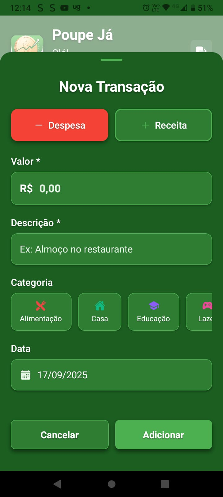
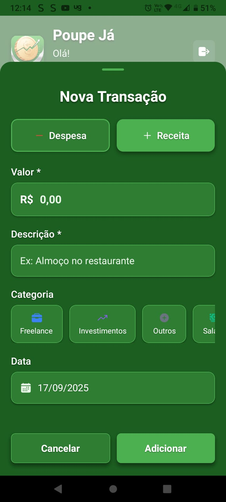

# poupe-ja

> Uma aplicação para auxiliar no gerenciamento de finanças pessoais, com simplicidade e eficiência.

---


## Screenshots

### Tela de Login


### Tela Inicial / Dashboard


### Tela de Criação de Conta


### Tela de Nova Transação - Despesa


### Tela de Nova Transação - Receita


### Tela de Todas as Transações


---

## 📑 Índice

- [Sobre o projeto](#sobre-o-projeto)  
- [Funcionalidades](#funcionalidades)  
- [Tecnologias](#tecnologias)  
- [Pré-requisitos](#pré-requisitos)  
- [Instalação](#instalação)  
- [Uso](#uso)  
- [Estrutura do projeto](#estrutura-do-projeto)  
- [Contribuição](#contribuição)  
- [Licença](#licença)  
- [Contato](#contato)  

---

## 📌 Sobre o projeto

O **poupe-ja** é um aplicativo criado para ajudar usuários a **organizar e acompanhar suas finanças pessoais**.  
A proposta é oferecer uma forma prática de registrar receitas e despesas, analisar relatórios e visualizar indicadores financeiros.  

---

## ⚙️ Funcionalidades

- Registro de transações (gastos e receitas).  
- Histórico financeiro detalhado.  
- Filtragem por categorias.  
- Dashboard com indicadores e relatórios.  
- Autenticação de usuário (via Supabase).  
- Interface responsiva.

---

## 🛠 Tecnologias

Este projeto utiliza as seguintes tecnologias:

| Área            | Ferramenta / Framework |
|-----------------|-------------------------|
| Linguagem       | TypeScript              |
| Frontend/App    | React / Next.js / Expo (ajustar conforme usado) |
| Backend / DB    | Supabase                |
| Estilos         | (Styled Components / Tailwind / etc.) |
| Utilitários     | Hooks e funções próprias |

---

## 📋 Pré-requisitos

Antes de começar, você vai precisar ter instalado na sua máquina:

- [Node.js](https://nodejs.org/) (versão 18 ou superior)  
- npm ou yarn  
- Conta e projeto no [Supabase](https://supabase.com/)  
- Arquivo `.env` configurado com as chaves da API  

---

## 🚀 Instalação

Clone o repositório e instale as dependências:

```bash
# Clonar repositório
git clone https://github.com/Zhennyn/poupe-ja.git

# Entrar na pasta do projeto
cd poupe-ja

# Instalar dependências
npm install
# ou
yarn install
```

SUPABASE_URL=...
SUPABASE_ANON_KEY=...

```bash
npm run dev
# ou
yarn dev
```

📬 Contato

Autor: Matheus Lima Menezes

Email: matheuslimamenezes2005@gmail.com
