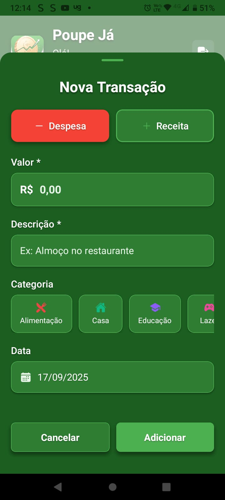
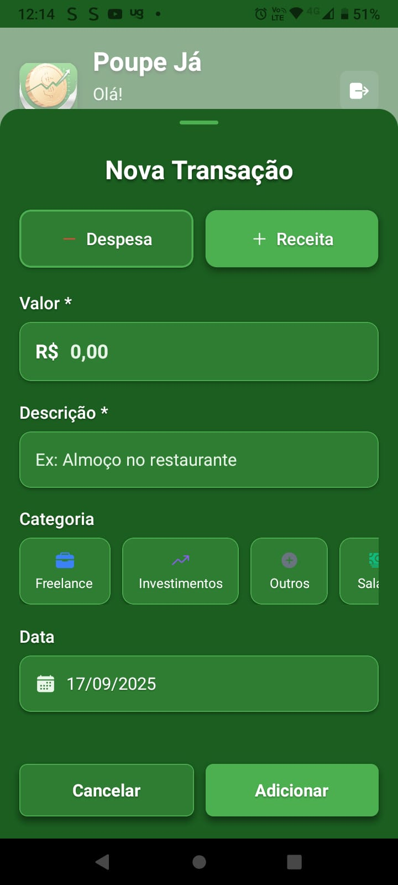

# 💰 Poupe Já — Controle Financeiro Pessoal

> Aplicativo mobile multiplataforma para registrar receitas e despesas, acompanhar seu saldo em tempo real e manter suas finanças organizadas.

---

<p align="center">
  
</p>

---

## ✨ Funcionalidades

- 🔐 **Autenticação segura** — cadastro e login via Supabase Auth
- 📊 **Dashboard interativo** — saldo total, receitas e despesas em um só lugar
- ➕ **Registro de transações** — adicione receitas ou despesas com categoria e data
- 🗂️ **Categorização** — organize seus gastos por tipo (alimentação, transporte, lazer, etc.)
- 📋 **Histórico completo** — lista paginada de todas as movimentações
- 🔎 **Detalhes da transação** — visualize descrição, valor, categoria e data em um bottom sheet
- 📱 **Interface responsiva** — funciona em Android, iOS e Web (Expo)

---

## 🛠️ Tecnologias Utilizadas


---

## 🚀 Como executar localmente

### Pré-requisitos

- [Node.js](https://nodejs.org/) v18 ou superior
- [Expo CLI](https://docs.expo.dev/get-started/installation/) instalado globalmente
- Conta e projeto criado no [Supabase](https://supabase.com/)

### Passo a passo

**1. Clone o repositório**
```bash
git clone https://github.com/Zhennyn/poupe-ja.git
cd poupe-ja
```

**2. Instale as dependências**
```bash
npm install
```

**3. Configure as variáveis de ambiente**

Crie um arquivo `.env` na raiz do projeto com as chaves do seu projeto Supabase:
```env
EXPO_PUBLIC_SUPABASE_URL=https://seu-projeto.supabase.co
EXPO_PUBLIC_SUPABASE_ANON_KEY=sua-chave-anonima
```

**4. Inicie o servidor de desenvolvimento**
```bash
npm run dev
```

**5. Abra no dispositivo**

- Escaneie o QR Code com o aplicativo [Expo Go](https://expo.dev/go) (Android/iOS)
- Ou pressione `w` para abrir no navegador

---

## 📸 Screenshots

<p align="center">
  
  &nbsp;&nbsp;
  
  &nbsp;&nbsp;
  
</p>

<p align="center">
  
  &nbsp;&nbsp;
  
  &nbsp;&nbsp;
  
</p>

---

## 🌐 Demonstração

> 🚧 Deploy em breve — o projeto pode ser executado localmente seguindo os passos acima, ou testado via Expo Go após clonar o repositório.

---

## 📌 Sobre o projeto

O **Poupe Já** é um aplicativo de controle financeiro pessoal desenvolvido em **2025** com foco em praticidade e clareza visual. O objetivo é ajudar qualquer pessoa a acompanhar suas finanças do dia a dia sem complicação.

**Por que este projeto é relevante para recrutadores de TI?**

| Competência | Como este projeto demonstra |
|---|---|
| 🗄️ Banco de Dados | Modelagem e consultas em PostgreSQL via Supabase |
| ☁️ Cloud / BaaS | Autenticação e banco de dados gerenciados em nuvem (Supabase) |
| 🔐 Segurança | Autenticação JWT, controle de sessão e rotas protegidas |
| 📱 Desenvolvimento Full-Stack | Frontend mobile + backend serverless integrado |
| 🔄 Automação & Hooks | Custom hooks reutilizáveis para estado e lógica de negócio |
| 📊 Visualização de Dados | Dashboard com indicadores de receita, despesa e saldo em tempo real |

---

## 🤝 Como contribuir

Contribuições são bem-vindas! Sinta-se à vontade para:

1. Fazer um **fork** do projeto
2. Criar uma **branch** para sua feature (`git checkout -b feature/minha-feature`)
3. Fazer o **commit** das suas alterações (`git commit -m 'feat: minha feature'`)
4. Enviar um **pull request**

---

<p align="center">Feito com ❤️ por <a href="https://github.com/Zhennyn">Zhennyn</a></p>
